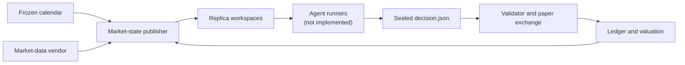
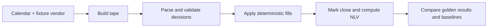

# Agent Trading Arena

> Same market. Same rules. Different subscribed agent systems.

Agent Trading Arena is a reproducible paper-trading benchmark for complete coding-agent products. It gives each agent the same simulated cash, US-equity market data, trading rules, and decision windows, then evaluates the resulting decisions with an independent deterministic paper exchange.

No real brokerage account, capital, or orders are involved. The benchmark measures the full product bundle—model, harness, tools, search, memory, and orchestration—rather than claiming to isolate the underlying model.

For the complete experimental design and frozen rules, see [PROTOCOL.md](PROTOCOL.md).

## Status

Protocol 0.2 and the offline evaluator through Phases A–C are implemented.

Available now:

- Strict JSON contracts for clocks, portfolios, fills, decisions, market snapshots, and ledger events.
- Deterministic order validation, pricing, fills, portfolio updates, and final valuation.
- Cash, SPY buy-and-hold, equal-weight, and seeded-random baselines.
- Frozen trading calendars, early-close scheduling, and a fixture market-data vendor.
- Reproducible tape generation, raw-input checksums, replica workspaces, and golden replay tests.

Not implemented yet:

- Live market-data integration.
- Subscription-authenticated agent runners.
- The wall-clock season orchestrator and pause/quota handling.
- Process reports and a completed shakedown or scored season.

## Experiment at a glance

| Dimension | Season 1 design |
|---|---|
| Starting portfolio | USD 1,000 simulated cash per replica |
| Market | Liquid US-listed equities and ETFs |
| Universe | Frozen S&P 100 constituents plus SPY, QQQ, and IWM |
| Schedule | Two sealed 15-minute rounds per trading day |
| Season | Three-day shakedown, reset, then 20 scored trading days |
| Trading | Long-only, fractional shares, no leverage or derivatives |
| Execution | Reference-minute VWAP or midpoint, with 5 bp adverse cost |
| Comparison | Median final net liquidation value across replicas |
| Baselines | Cash, SPY, equal weight, and seeded random |

## Architecture



The implemented offline path can generate and replay a complete fixture tape without launching an agent:



## Setup

Requirements:

- Python 3.11 or newer
- Git

Clone the repository and create a virtual environment:

```bash
git clone https://github.com/bayareahomelander/Agent-Trading-Arena.git
cd Agent-Trading-Arena
python -m venv .venv
```

Activate it:

```bash
# macOS / Linux
source .venv/bin/activate

# Windows PowerShell
.venv\Scripts\Activate.ps1
```

Install the package and development dependencies:

```bash
python -m pip install -e ".[dev]"
```

Run the test suite:

```bash
python -m pytest -q
```

## Project structure

```text
.
├── README.md                 # Project overview and setup
├── PROTOCOL.md               # Full experiment specification
├── pyproject.toml            # Package metadata and dependencies
├── src/arena_kernel/
│   ├── schema/               # JSON contracts and serialization
│   ├── calendar.py           # Trading days and round schedules
│   ├── marketdata.py         # Vendor interface and tape publishing
│   ├── validate.py           # Decision business rules
│   ├── pricing.py            # Reference prices and execution cost
│   ├── matching.py           # Orders, fills, cash, and positions
│   ├── ledger.py             # Close marks, NLV, and medians
│   ├── replay.py             # Deterministic fixture-tape replay
│   └── baselines.py          # Four non-agent comparison portfolios
├── fixtures/golden/          # Frozen calendars, tapes, and expected output
└── tests/                    # Unit and golden integration tests
```

## Core guarantees

- Money and quantities use decimal arithmetic; IEEE floating-point inputs are rejected.
- Orders remain sealed until a common decision deadline.
- Sells execute before buys, then by declared priority.
- Every fill is reconstructable from an archived reference bar and fixed formula.
- Missing common data stops the relevant tape operation instead of inventing a price.
- Agent and baseline portfolios use the same matching and valuation logic.

## Documentation

[PROTOCOL.md](PROTOCOL.md) contains the complete methodology, including fairness principles, workspace and decision contracts, market rules, failure handling, scoring, audit requirements, safety constraints, and interpretation limits.

## Disclaimer

This is a research project using simulated money. It is not investment advice, evidence of real-world profitability, or a system for placing real orders.
