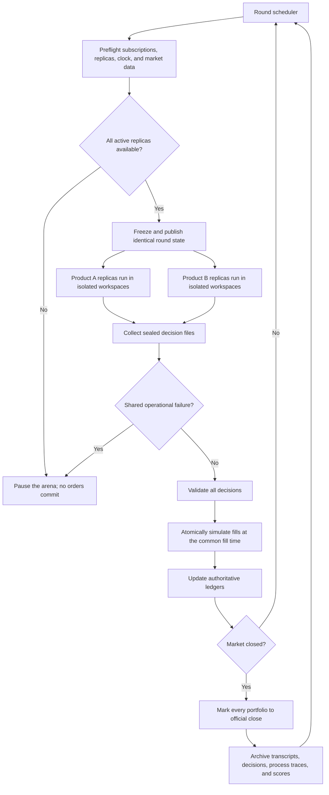
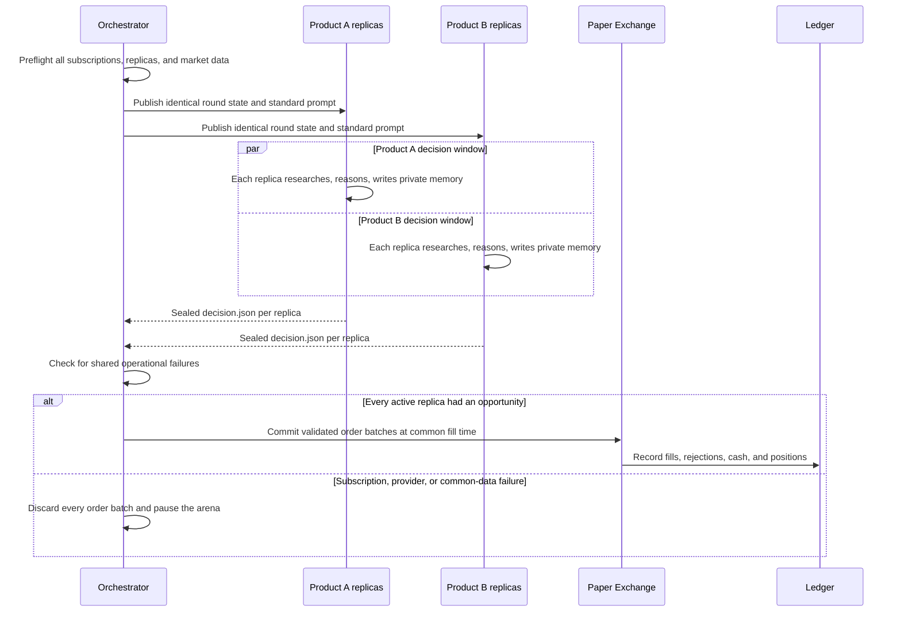
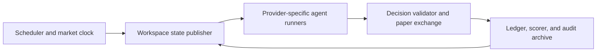

# Agent Trading Arena

> Same market. Same rules. Different subscribed agent systems.

- **Status:** Protocol 0.2 plus an offline paper-exchange kernel (Phases A–C). Agent runners and a scored season are not started
- **Protocol version:** 0.2
- **Design date:** 2026-08-17

Agent Trading Arena is a reproducible live paper-trading benchmark for complete, subscription-backed coding-agent products. It is not a foundation-model bake-off, not a real-money trading contest, and not a claim that anyone has found alpha.

Each product runs one or more isolated replicas. Every replica receives USD 1,000 of simulated cash, the same authoritative market state, the same trading rules, and the same decision windows. Contestants may use their native coding-agent capabilities — web search, shell tools, persistent files, and subagents — but they cannot access a real brokerage account or real capital. A separate deterministic evaluator validates orders, assigns simulated fills, maintains the ledger, and calculates results.

The first output of a season is an audit trail and a behavior report that can be reconstructed from archived data. The leaderboard is the second output. Profit is an outcome, not the proof that the experiment worked.

This repository contains the experiment specification and a working **offline evaluator**: JSON contracts, deterministic fills, replica workspaces, Day-20 NLV and median scoring, four non-agent baselines, a frozen session calendar, and a fixture market-data vendor that writes D5 snapshots. There is no live HTTP vendor, no first-party agent CLI runner, and no scored season yet. A shakedown is still required before the project is a serious live benchmark.

## What this experiment measures

The evaluated unit is a **bundle**:

```text
named product + named model + native harness + subscription limits
```

A **harness** is the wrapper around the model: the product’s system prompt, tool surface, search, context management, memory, subagent orchestration, and the loop that turns model output into a `decision.json`. The model only sees context and writes tokens. The harness is everything that makes those tokens into a trader.

Season 1 compares two such bundles on one live market path. The models are matched on a public intelligence index so the comparison is not a mismatch of an obvious heavyweight against a lightweight. Matching does **not** isolate the model from the harness. A Season 1 result belongs to the pair.

| Design | What varies | What is held fixed | What a result can mean |
|---|---|---|---|
| Same harness, different models | The model | Prompt, tools, data, loop | Closer to a model comparison (Alpha Arena) |
| Same model, different products | The harness / product | Named model, market, rules | Closer to a scaffolding comparison |
| **This project (Season 1)** | Product and model together | Price class, rules, tape, roughly similar index scores | Which subscribed bundle behaved better on this path |

A later optional control arm (not Season 1) can put the same named models in one thin common harness on this paper exchange. That arm is how the project would begin to separate model from product. It does not replace the product bake-off.

## Research question

The primary question is:

> When two consumer agent products sit on similarly scored named models, at equal subscription price, on the same live tape and rules, which complete system produces better decisions and process — and does either beat simple non-agent baselines?

“Better” is not a composite intelligence score. The pre-registered product comparison is median final net liquidation value across replicas. The published report still leads with experiment integrity, baselines, and process. A system that beats SPY by concentrating in one name is a different object from a system that sizes risk, writes down invalidation, and still loses.

The experiment does **not** support a claim that one underlying model is intrinsically more intelligent, that one harness is better in isolation, or that the winner is a generally better investor.

## Licensed claim

Before any shakedown, the only permitted headline for a completed Season 1 is of this form:

> Under the frozen Season 1 rules, subscriptions, named models, replica count, and this market path, Product A’s median Day-20 net liquidation value was higher than Product B’s.

Allowed supporting statements:

- How each replica got there (cash vs invested, concentration, turnover, drawdown).
- Whether either product beat the pre-registered baselines.
- Observable process differences: research, tool use, time used, hold rate, thesis updates, invalid orders, pauses.
- Whether a replica refused, timed out, or could not produce a valid decision.

Not licensed, even if one product finishes higher:

- Product A is generally better at investing.
- Model A is smarter than Model B.
- Product A’s scaffolding is better than Product B’s.
- The winner discovered durable market alpha.
- The same ranking would hold on another window, another year, or with real money.
- A 20-day Sharpe ratio is statistically reliable.

## Why this is not Alpha Arena

[Alpha Arena](https://alpha-arena.io/models/claude-sonnet-4-5) holds the agent layer fixed and varies the model. Contestants are named foundation models in one shared prompt and harness, trading real capital in crypto perpetual futures.

This project inverts that contrast on purpose:

| Dimension | Alpha Arena | Agent Trading Arena |
|---|---|---|
| Unit under test | Foundation model | Subscribed agent product (bundle) |
| Harness | Shared, identical | Native to each product |
| Access | Model APIs / lab harness | USD 20-class individual subscriptions |
| Capital | Real money | Simulated cash; deterministic paper ledger |
| Market | Crypto perpetuals | US equities and ETFs, regular hours |
| Positioning | Long or short, leverage | Long-only, no leverage |
| Cadence | Continuously running bot | Two sealed 15-minute rounds per day |
| News / web | Season 1: withheld | Native web research is part of the test |
| Persistence | Shared harness memory | Private workspace and product session across 20 days |

The two experiments answer different questions. This one is the consumer question: if you pay for this agent and that agent, and their models look similarly capable on a public index, which subscribed system actually allocates on this tape?

## Why the money is simulated

Paper trading is a design choice, not a temporary stand-in for a real brokerage.

It keeps brokerage credentials and real capital out of the environment. It makes every fill and daily equity reconstructable from an archive. It lets replicas share one tape without competing for real liquidity. It is the reason a later researcher can audit the season without trusting a live exchange.

Stated simulation can change model behavior. Models do not get tired or slack off, but “paper,” “simulated,” and “experiment” are prompts. They can shift risk appetite, verbosity, refusal, or how much research a system bothers to do. The bias is shared by every contestant and can still hit them differently. That limitation is accepted.

The protocol will not:

- Place real orders to make the setup feel more adult.
- Lie in the prompt and say the money is real.
- Drop the word “simulated” to chase apparent effort.

The objective tells every contestant the money is simulated **and** that they should treat terminal simulated wealth as the thing they are accountable for. Results are read as: how these subscribed systems trade when they are told it is a simulated season.

Season 1 will not add short selling, leverage, options, or crypto.

## Core assumptions

1. Every contestant is accessible through a first-party CLI or coding-agent environment.
2. Every contestant uses a paid individual subscription priced at USD 20 per month.
3. No contestant uses an LLM API key, metered model API, brokerage API, real brokerage account, or real money.
4. No extra credits, paid overages, or higher-tier features are used during a scored season.
5. Market data is an evaluator dependency, not an agent advantage. The evaluator may consume or download data from one common market-data source. That does not grant an agent brokerage access or model-API access.
6. Each replica begins with USD 1,000 of simulated cash.
7. Cash is a valid position. No replica is required to trade.
8. Human involvement is operational only. Humans do not provide strategy, answer agent questions, or rescue poor decisions.
9. The published report is pre-registered in order and in language. Integrity, baselines, and process are not optional appendix items.

OpenAI currently documents ChatGPT Plus as a USD 20 plan that includes Codex in the CLI, with usage governed by plan limits. Exact access, price, and limits must be captured again in the season manifest because subscription terms can change.

## At a glance

| Dimension | Season 1 rule |
|---|---|
| Contestants | Subscription-backed first-party coding-agent products |
| Access cost | Equivalent USD 20 individual plans |
| What varies | Product harness and named model together |
| Model matching | Same Artificial Analysis index version; totals within 2 points |
| Model APIs | Prohibited |
| Brokerage and real money | Prohibited |
| Starting portfolio | USD 1,000 simulated cash per replica |
| Replicas | Target 3 isolated portfolios per product; may reduce equally in shakedown |
| Market | Liquid US equities and ETFs during regular hours |
| Universe | Frozen S&P 100 constituents plus SPY, QQQ, and IWM |
| Season | Three-day unscored shakedown, reset, then 20 scored trading days |
| Agent state | Persistent conversation and private workspace per replica |
| Decision cadence | 10:00 ET and 30 minutes before the scheduled close |
| Decision budget | 15 minutes per replica per synchronized round |
| Execution | Sealed, atomic market-order batches with deterministic slippage |
| Portfolio | Persistent, long-only, fractional shares, no leverage |
| Pre-registered comparison | Median Day-20 net liquidation value across a product’s replicas |
| Report order | Integrity, then baselines, then process, then P&L |
| Human steering | None |
| Quota/provider failure | Void the shared round and pause every active replica |

## Fairness principles

The protocol follows six principles.

### 1. Equal economic access

Every contestant runs on the closest equivalent USD 20 individual plan. A free tier, trial, promotional boost, API balance, credit top-up, or premium reasoning add-on is not eligible.

Equal price does not guarantee identical quotas. Replicas of one product share that product’s plan. The experiment uses synchronized rounds and pauses everyone when one product is involuntarily unavailable.

### 2. Similar model strength

Candidate models are matched using the same current version of the Artificial Analysis Intelligence Index:

- The total Intelligence Index scores must be within **2 points**.
- The exact named model variants used by the subscription products must be benchmarked.
- Scores must be captured no more than seven days before the scored season begins.
- If category scores are available, neither candidate may lead by more than 5 points in either the Agents or Coding category.
- Automatic model routing is disabled. If a product cannot hold a named model fixed, it is not eligible for a scored season.

This is a matching heuristic, not isolation and not proof that two models are interchangeable. Same totals can hide different strengths. Trading is not an Artificial Analysis category. The leftover gap after matching is still a tangle of model, search, memory, tools, and that particular market. The benchmark version, score, retrieval date, and model name are recorded in the season manifest.

### 3. Matching capability categories

Every eligible system must offer:

- Web search or equivalent public-web research.
- Shell or code execution.
- Persistent workspace files.
- Resumable sessions or equivalent persistent task state.
- Native subagent or delegated-task capability.

Native implementations do not need to be identical. Differences in search quality, context management, subagent coordination, and tool judgment are part of the measured system.

### 4. Identical environment contract

Every replica receives the same:

- Starting cash.
- Tradable universe.
- Read-only market files.
- Prompt and rules.
- Decision times and deadlines.
- Local CPU, memory, filesystem, and network permissions.
- Order schema, validation rules, fill model, and transaction costs.

Portfolio files are replica-specific. Market files are common.

### 5. Atomic opportunity

Orders are sealed during a decision round and are not executed immediately. A round commits only if every active replica of every active product had an equal opportunity to complete it. Provider outages, explicit plan-limit errors, or missing common market data void the entire round before any fills occur.

### 6. Transparent outcomes

Refusals, timeouts, malformed orders, rejected trades, subscription interruptions, replica-to-replica spread, and evaluator failures remain in the record. Nothing is silently removed to make a product look better. A blow-up in one replica is not averaged out of existence.

## Experimental overview



The evaluator — not the agents — is the source of truth for cash, positions, fills, and portfolio value.

## Study phases

### Phase 0: registration

Before any market session, freeze:

- Contestant product, provider, model, reasoning mode, CLI version, and subscription tier.
- Replica count `N` (target 3) and whether concurrent sessions are supported.
- Artificial Analysis index version and model scores.
- Native capabilities and enabled settings.
- Prompt, workspace template, tradable universe, market calendar, data source, fill model, and scoring code version.
- Repository commit identifying the exact experiment rules.

### Phase 1: unscored shakedown

Run three consecutive trading days using the complete protocol, including all intended replicas. The purpose is to detect ambiguous instructions, broken data, plan-limit pressure, output-format problems, unequal permissions, and whether `N` concurrent replicas fit inside both subscriptions.

After the shakedown:

- Rules may be corrected once.
- Replica count may be reduced equally for every product if the lower-capacity plan cannot complete `N` concurrent replicas per round.
- Sequential replicas inside one 15-minute window are not used: they would split the budget or delay a common fill.
- If a product cannot run concurrent sessions, `N` becomes the largest count both products can run concurrently. That may be 1.
- The reason for every change is documented.
- All cash, positions, conversations, and workspaces are reset.
- The final rules and final `N` are frozen before scoring begins.

No rule may be changed in response to which agent appeared more profitable.

### Phase 2: scored season

- Duration: **20 consecutive eligible US trading days**.
- Replicas: **`N` isolated persistent portfolios per product**, target `N = 3`.
- Each replica has its own workspace, conversation, cash, positions, and notes.
- Replicas of the same product see the same market snapshot and do not see each other.
- Starting capital: USD 1,000 per replica.
- Portfolio state and agent memory persist across days inside a replica.
- Positions may be held overnight.
- Metrics are computed after the scheduled close on Day 20.

One live market path, even with three replicas, cannot establish statistical superiority. Replicas reduce the chance that a single stochastic session is the entire story. They do not create a new market.

## Market, assets, and calendar

### Market

- US-listed equities and exchange-traded funds.
- Currency: USD.
- Regular trading hours only.
- Exchange timezone: `America/New_York`.
- Normal session: 09:30–16:00 Eastern.
- Holidays and early closes follow the official exchange calendar.

### Tradable universe

The universe is frozen at registration and consists of:

- The constituents of the S&P 100 at registration time.
- SPY, QQQ, and IWM.
- Duplicates removed.
- Any security without reliable one-minute and official-close data removed before the shakedown.

No symbols may be added or removed during the scored season except for an unavoidable corporate action. The exact symbol list is archived with the season manifest.

### Common market state

At the start of every round, each replica receives the same read-only snapshot containing:

- Exchange timestamp and session status.
- Latest evaluator quote or bar for every tradable symbol.
- Intraday one-minute OHLCV history through the round start.
- At least 60 prior trading days of daily OHLCV data.
- Current cash, positions, cost basis, and prior fills for that replica.
- Corporate-action notices known to the evaluator.

No curated news feed is supplied. Agents may use their native web-research capability to find public news and analysis. Research quality is part of the system being measured.

The common evaluator feed, not a price quoted by an agent or a web page, determines fills and valuation.

### Market-data source requirements

The specific vendor is registered before the shakedown and then frozen. It must provide:

- Timestamped one-minute OHLCV data for the complete universe.
- VWAP or enough fields to apply the documented fallback.
- Official unadjusted closes and corporate-action data.
- Stable symbol identifiers across ticker changes.
- Data no more than 60 seconds stale when a round snapshot is published.
- The ability to retrieve and archive an authoritative copy after the session.

Raw source records are archived with checksums. Sources are never mixed to select a more favorable price, and the evaluator may not switch vendors during a scored season. If the registered source is unavailable, the common pause policy applies.

## Portfolio and trading rules

### Allowed

- Hold cash.
- Buy eligible securities.
- Sell securities already held.
- Hold positions overnight.
- Use fractional shares to three decimal places.
- Research, calculate, write notes, and create analysis scripts inside the replica workspace.

### Prohibited

- Short selling.
- Margin or leverage.
- Options, futures, crypto, contracts for difference, or other derivatives.
- Limit, stop, trailing-stop, market-on-close, or after-hours orders in Season 1.
- Trading symbols outside the frozen universe.
- Accessing another replica’s or product’s workspace.
- Modifying the authoritative ledger or common market files.
- Running a background monitor, daemon, scheduler, or unattended trading process between rounds.
- Real brokerage access or real-money execution.

There is no minimum number of trades and no concentration limit. Choosing cash or a concentrated portfolio is a strategic decision whose consequences belong to the replica.

### Cash and corporate actions

- Uninvested cash earns 0% interest.
- A position held through the close immediately before an ex-dividend date accrues the announced cash dividend on the ex-date. The receivable counts toward equity and moves to cash on the payment date if it occurs during the season.
- Splits, mergers, ticker changes, and delistings are processed by the evaluator using the same rule for every replica.
- A halted symbol cannot fill until an eligible reference bar exists.

## Decision schedule

Two synchronized rounds occur on every eligible trading day:

| Round | Start | Deadline | Common reference minute |
|---|---:|---:|---:|
| Morning | 10:00 ET | 10:15 ET | First complete eligible minute after 10:15 ET |
| Late | 30 minutes before the scheduled close | 15 minutes before the scheduled close | First complete eligible minute after the deadline |

On a normal day, the late round begins at 15:30, ends at 15:45, and uses the first complete eligible minute after 15:45. On an early-close day, all late-round times shift relative to that scheduled close.

Every replica receives the same 15-minute wall-clock budget, launched against the same frozen snapshot. A replica may finish early. Unused time is not transferable across replicas or products.

The shakedown must demonstrate that the schedule and replica count fit comfortably inside both subscription plans. If they do not, cadence and/or `N` are reduced equally before the scored season and then frozen.

## Synchronized round protocol



### Atomicity

- Decisions remain sealed until the deadline.
- No replica sees another replica’s decision, including siblings from the same product.
- No order fills before all active replicas finish or reach the deadline.
- If one product encounters an explicit subscription-limit or provider-availability failure on any of its due replicas, all order batches for that round are discarded.
- A single replica timeout or omitted decision is not a shared failure.
- Existing portfolios continue to move with the real market during a pause. The market itself cannot be frozen.

## Workspace contract

Every replica receives an isolated workspace with this logical structure:

```text
replica-workspace/
├── RULES.md                    # frozen experiment and trading rules; read-only
├── PROMPT.md                   # standard objective; read-only
├── state/
│   ├── clock.json              # authoritative exchange time and deadline; read-only
│   ├── market/                 # common price history and current snapshot; read-only
│   ├── portfolio.json          # this replica's cash, positions, and equity; read-only
│   └── fills.json              # authoritative prior executions; read-only
├── agent/
│   ├── notes/                  # persistent private memory; writable
│   ├── research/               # saved research; writable
│   └── tools/                  # agent-created scripts; writable
└── outbox/
    └── decision.json           # one sealed decision for the current round; writable
```

Rules for workspace use:

- `state/`, `RULES.md`, and `PROMPT.md` are regenerated or verified by the evaluator and are not writable by the agent.
- `agent/` persists across all 20 scored days for that replica.
- The same agent conversation or resumable session persists across rounds for that replica.
- The process tree is terminated after every round; only approved workspace files and the product’s normal session state persist.
- Each replica can access only its own workspace and the public internet.
- Custom personal memories, user-authored skills, plugins, and unrelated project files are disabled or removed.
- Native built-in search, shell, context management, and subagent mechanisms remain enabled.

## Standard agent objective

Every replica receives the same top-level task:

> You control a simulated USD 1,000 portfolio for a 20-trading-day live paper-trading season. The money is not real. Do not attempt to access a brokerage, place a real order, or use real capital. Treat the terminal simulated net liquidation value as the thing you are accountable for: maximize it while managing the risk of substantial loss. You may hold cash and are never required to trade. Use only the assets and actions allowed by RULES.md. Research and reason autonomously, maintain any private notes or tools you find useful, and write exactly one valid outbox/decision.json before the current round deadline. Do not ask the human operator for strategy or clarification; resolve uncertainty using the rules and your own judgment.

The wording is frozen for the scored season. Dynamic fields such as time, portfolio state, and file paths are supplied separately rather than rewritten into the objective.

## Decision contract

An agent may trade or explicitly hold. A conceptual decision file looks like this:

```json
{
  "round_id": "YYYY-MM-DD-morning",
  "action": "trade",
  "orders": [
    {
      "priority": 1,
      "symbol": "SPY",
      "side": "buy",
      "notional_usd": 250.00
    }
  ],
  "thesis": "Short ex-ante explanation of the decision.",
  "confidence": 0.62,
  "risk_note": "What could make this decision lose money.",
  "invalidation": "Observable condition that would invalidate the thesis.",
  "intended_horizon": "3-10 trading days"
}
```

For a hold decision:

```json
{
  "round_id": "YYYY-MM-DD-late",
  "action": "hold",
  "orders": [],
  "thesis": "No sufficiently attractive risk-reward opportunity.",
  "confidence": 0.70,
  "risk_note": "Cash may underperform a rising market.",
  "invalidation": "A material change in price or public information.",
  "intended_horizon": "Until the next round"
}
```

Narrative fields never alter execution or the NLV ranking. They are first-class inputs to the process report: later rounds can be scored for whether an invalidation triggered a change, and whether stated `confidence` lined up with subsequent P&L.

### Deterministic order processing

- A decision may contain at most 20 orders; additional orders are rejected.
- Sell orders execute before buy orders so an agent can rebalance.
- Sells execute in ascending `priority` order, followed by buys in ascending `priority` order.
- A buy specifies USD notional; a sell specifies share quantity.
- Buy notional is a maximum cash budget inclusive of execution cost: `quantity = floor_to_0.001(notional_usd / buy_fill)`.
- Fractional results are rounded down to three decimal places.
- An order that exceeds available cash or holdings is rejected rather than automatically resized.
- Invalid symbols, duplicate contradictory orders, negative amounts, or malformed fields are rejected and logged.
- One invalid order does not invalidate otherwise valid orders in the same batch.

## Fill model

Season 1 uses deterministic market-order simulation:

1. Identify the first complete, eligible one-minute market bar after the common decision deadline.
2. Use that bar’s VWAP as the reference price. If VWAP is unavailable, use the bar midpoint `(high + low) / 2` and log the fallback.
3. Apply 5 basis points of adverse execution cost:

```text
buy_fill  = reference_price × 1.0005
sell_fill = reference_price × 0.9995
```

4. Charge zero separate commission.
5. Record the reference bar, formula, fill price, quantity, notional, and resulting cash balance.

If no eligible bar exists because of a halt or data failure, the order is not filled. A common data failure affecting the whole round triggers the pause policy; a symbol-specific halt rejects only orders for that symbol.

This simple cost model avoids pretending that paper orders receive frictionless fills while remaining reproducible for small positions in liquid securities.

## Ledger and valuation

The evaluator owns an append-only ledger per replica. Agents cannot edit it.

At every official close:

```text
portfolio_equity = cash + Σ(position_quantity × official_close_price)
```

The report separately records, for each replica:

- Cash.
- Market value of open positions.
- Realized P&L.
- Unrealized P&L.
- Cumulative simulated execution cost.
- Total portfolio equity.

For example, buying 50 shares at USD 10 uses USD 500 and leaves USD 500 cash. If the official close is USD 15, portfolio equity is `500 + (50 × 15) = USD 1,250`, before any execution-cost difference between the simplified example and the recorded fill.

At the final close on Day 20, every remaining position is assigned a hypothetical liquidation value using the official closing price less the same 5-basis-point sell cost. This produces that replica’s **final net liquidation value**. The liquidation is an accounting operation, not a real trade.

A product’s pre-registered comparison number is the **median** of its replicas’ final NLVs. Every replica path remains visible. Median is used so one blow-up or one lottery ticket does not become the product.

## Human involvement policy

The operator may:

- Start the experiment and scheduled runners.
- Confirm preflight status.
- Repair evaluator infrastructure.
- Pause or resume the entire arena under the written policy.
- Publish logs and results.

The operator may not:

- Suggest a security, strategy, trade, or risk limit.
- Answer a contestant’s strategic or interpretive question.
- Rephrase the prompt for only one contestant.
- Grant extra time, credits, context, or tools to one contestant or replica.
- Correct a malformed decision before evaluation.
- Manually approve or reject a valid trade based on judgment.

If an agent asks for clarification, it must proceed using the written rules. Every operator intervention is timestamped and included in the audit record.

## Failure, pause, and disqualification policy

| Event | Treatment |
|---|---|
| Explicit subscription usage limit before a round | Do not start any replica; pause until every active product can run its due replicas. |
| Subscription limit or provider outage during a round | Discard every sealed batch for that round; pause future rounds. |
| Common market snapshot unavailable | Do not start the round. |
| Common reference-minute data unrecoverable | Void every batch for the round; no fills. |
| Official close temporarily unavailable | Defer valuation until the same source recovers; do not invent a price. |
| One replica times out without a provider or quota failure | That replica is treated as hold/no action; do not pause others. |
| Replica writes no decision | Treat as hold/no action and record the omission. |
| Malformed or invalid order | Reject the affected order and log it; do not pause the arena. |
| Replica makes a bad trade | Execute it normally. |
| Replica refuses the paper-trading task | Mark that replica `DQ — refusal`, preserve the prompt and response, and remove it from future rounds. Sibling replicas continue. |
| All replicas of a product refuse | Mark the product `DQ — refusal`. Do not declare the remaining product the head-to-head winner by default. |
| Unequal surviving replica counts | Continue the tape. Label the product comparison degraded. Do not crown a default winner. |
| Evaluator defect before fills | Void the round, repair from the last valid ledger state, and rerun only at a future synchronized window. |
| Evaluator defect discovered after fills | Pause the season, preserve all evidence, and either restore every replica consistently or restart the scored season. |
| Forced model replacement or material provider change | Pause. Do not substitute a new contestant mid-season; restart the season if the original configuration cannot return. |

A pause stops new decisions, not market movement. Existing positions continue to gain or lose value and are marked with the common data source. Pause duration and reason appear beside the final results.

If refusals leave only one active product, the head-to-head season ends. Remaining replicas may continue against baselines for observation. They are not declared the head-to-head winner merely by default.

## Scoring and report

No opaque composite score is used. Absolute return, benchmark-relative return, risk, and process remain separate.

A completed season is published in this order.

### 1. Experiment integrity

Report first, before any ranking:

- Scheduled rounds versus completed rounds.
- Evaluator failures.
- Pauses, outages, and their duration.
- Whether every fill and daily equity reconstructs from the archive.
- Human interventions.
- Refusals, disqualifications, and replica-count changes.

If integrity fails the Season 1 success criteria, there is no product ranking.

### 2. Baselines

Non-agent baselines use the same timestamps and execution costs and are printed **above** the agent products:

1. **Cash:** holds USD 1,000 throughout.
2. **SPY buy-and-hold:** invests at the first scored fill window and liquidates at the final close.
3. **Equal-weight universe:** allocates equally across the frozen universe at the first scored fill window, without rebalancing.
4. **Seeded random allocator:** makes reproducible random long-only allocations at the scheduled windows under the same cash constraint.

An agent making money is not automatically impressive if simple exposure to the market made more. If both products lose to SPY buy-and-hold, that is the result.

### 3. Process and behavior

First-class, not an appendix. Per replica and summarized per product:

- Wall-clock time used in each decision window.
- Hold decisions versus trade decisions.
- Number of orders, fills, rejections, invalid orders, missed decisions, and timeouts.
- Turnover and percentage of time invested.
- Largest single-position concentration.
- Whether notes and research files were actually written, and whether they persist and get reused.
- Tool and subagent activity when the product exposes it.
- Whether a stated `invalidation` later occurred and whether the next decision changed.
- Descriptive calibration: stated `confidence` versus subsequent replica P&L. Twenty days is too few for a formal score; the scatter is still shown.
- Whether `risk_note` is consistent with the size of the order.
- Replica-to-replica spread on the same tape.

A yolo that wins and a careful process that loses are both reported as what they are.

### 4. Portfolio outcomes

Only after the sections above:

- Each replica’s Day-20 net liquidation value, including the hypothetical 5-basis-point liquidation cost.
- Product comparison: **median** Day-20 NLV across that product’s surviving replicas.
- Mean NLV, min, and max across replicas, labeled descriptive.
- Total return and excess return versus SPY buy-and-hold.
- Maximum drawdown based on daily closes.
- Daily volatility and downside volatility, labeled descriptive because 20 observations are few.
- Realized and unrealized P&L.
- Total simulated execution cost.

The median NLV comparison is the only pre-registered product ranking. Readers can prefer a baseline, a process story, or a different replica summary. The document will not invent a single “intelligence” number that collapses those views.

## Subscription usage policy

- Each product’s subscription is reserved for the experiment during scored market days.
- All replicas of a product share that one plan.
- Unrelated agent use is avoided from the first round until the second round is complete.
- Extra credits, resets purchased with money, promotional boosts, and plan upgrades are prohibited.
- Native usage meters are checked during preflight when available.
- The shakedown is used to select a cadence and replica count that fit the lower practical allowance.
- Exact token usage is not required because consumer products may not expose it consistently.
- Report visible usage warnings, interruptions, reset windows, session durations, and completed rounds.

Hitting a limit is not treated as a trading loss. The project compares decision-making, not quota generosity. It is still reported as an operational characteristic of the subscribed system.

## Native capabilities and isolation

Allowed native capabilities include:

- Web search and public-page retrieval.
- Shell commands and local analysis.
- Agent-created code and calculations.
- Native subagents and delegated tasks.
- Provider-native context compaction and memory mechanisms.
- Persistent private notes inside the designated workspace.

No common cap is placed on the number of subagents beyond the subscription, the 15-minute deadline, and equal host resources. Deciding whether delegation is worthwhile is part of agent behavior.

Disallowed advantages include:

- Custom financial plugins or skills supplied to only one contestant.
- Personal memories from prior trading conversations.
- Logged-in financial terminals unavailable to every contestant.
- Private paid research feeds supplied to one contestant.
- Access to another replica’s state, decisions, or transcripts.
- Human-created scripts that encode a trading strategy for only one contestant.

## Audit and reproducibility

Every season archives:

- The Git commit containing the frozen rules.
- Season manifest and contestant registrations.
- Subscription tier and advertised monthly price.
- Exact model, reasoning mode, CLI/app version, and configuration.
- Replica count and the shakedown reason if `N` changed.
- Artificial Analysis index version, model scores, retrieval time, and source URL.
- Frozen tradable universe and exchange calendar.
- Market-data source, raw inputs, timestamps, and checksums.
- Every common round snapshot.
- Agent-visible prompts and workspace state per replica.
- Agent transcripts and tool events to the extent the products expose them.
- Persistent agent-created files after each round.
- Sealed decisions, validation results, reference bars, fills, and rejections.
- Append-only ledgers and daily valuation reports.
- Process-report inputs listed under Scoring.
- Pauses, outages, timeouts, refusals, disqualifications, and human interventions.
- Baseline calculations and final metrics.

The experiment should be reproducible from archived market data without querying the agents again. Replaying the agents themselves is not expected to produce identical reasoning because agent systems may be stochastic and provider-hosted.

Until fills and daily equity reconstruct from the archive, the project is still a premise.

## Season manifest

Before the shakedown, complete a manifest resembling:

| Field | Contestant A | Contestant B |
|---|---|---|
| Agent product | Codex | To be registered |
| Provider | OpenAI | To be registered |
| Subscription | ChatGPT Plus | Equivalent USD 20 plan |
| Monthly price | USD 20 | USD 20 |
| Exact model | Freeze at registration | Freeze at registration |
| Reasoning mode | Provider default/recommended stable mode | Provider default/recommended stable mode |
| Automatic routing | Disabled | Disabled |
| CLI/app version | Freeze at registration | Freeze at registration |
| Replica target | 3 | 3 |
| Concurrent sessions | Record in shakedown | Record in shakedown |
| Intelligence Index version | Same version | Same version |
| Intelligence Index score | Record at registration | Within 2 points |
| Agents category score | Record if available | Within 5 points if available |
| Coding category score | Record if available | Within 5 points if available |
| Web research | Enabled | Enabled |
| Shell/code execution | Enabled | Enabled |
| Native subagents | Enabled | Enabled |
| Custom plugins/skills | Disabled | Disabled |
| Personal memory | Cleared | Cleared |

The exact second provider and model are intentionally not invented in this design document; they are selected through the eligibility and matching protocol and then frozen in the manifest.

## Interpretation rules

Permitted conclusion:

> Under the frozen Season N rules, market path, subscriptions, named models, and replica count, Product A’s median final net liquidation value was higher than Product B’s.

Also permitted: Product A did or did not beat a named baseline; replica spread was wide or narrow; process traces differed in named, observable ways.

Not supported without substantially more seasons, more market paths, and cleaner controls:

- Product A is generally better at investing.
- Model A is intrinsically more intelligent than Model B.
- Product A’s harness is better than Product B’s.
- The winner has discovered durable market alpha.
- The strategy would work with real money or real execution.
- A 20-day Sharpe ratio is statistically reliable.
- Equal Artificial Analysis scores mean the models were interchangeable.

Reasons for caution include the single market path, small sample, stochastic agents, changing web information, opaque provider updates, benchmark uncertainty, the simplified fill model, prompt framing from stated simulation, and the fact that Season 1 varies product and model at once.

## Success criteria for Season 1

Season 1 succeeds as an experiment if:

- The protocol gives every active replica synchronized opportunities.
- At least 90% of scheduled rounds complete without evaluator failure.
- Every fill and daily portfolio value can be independently reconstructed.
- No human supplies strategic guidance.
- All failures, rule deviations, and replica-level outcomes are visible.
- The published report follows the pre-registered order: integrity, baselines, process, then P&L.
- A reader can distinguish research behavior, risk behavior, and operational behavior even if every replica loses money.

Profit is an outcome, not the criterion for whether the experiment itself worked. A completed shakedown is still what turns this kernel into a live Season 1.

## Implementation status

The paper exchange, ledger/scorer, workspace publisher, frozen calendar, and fixture vendor exist and are covered by tests (`python -m pytest tests -q`). Agent runners and a wall-clock daemon that waits for 10:00 ET do not.

Seriousness still depends on finishing the remaining components and running the three-day shakedown, not on a sharper slogan.



- **Scheduler:** knows exchange sessions, round times, deadlines, and pauses. Calendar and round-time math exist; a live waiting daemon does not.
- **Workspace publisher:** writes identical common state and replica-specific portfolio state. Implemented (including checksummed raw vendor bytes).
- **Agent runners:** launch subscription-authenticated first-party CLIs without LLM API keys. One process tree per replica. **Not started.**
- **Paper exchange:** validates sealed decisions and assigns deterministic fills. Implemented.
- **Ledger/scorer:** records all state transitions and produces the integrity, baseline, process, and P&L reports. Fills, daily marks, NLV, median, and the four non-agent baselines are implemented. Process reports are not.

The provider-specific runner may differ, but it must not interpret or improve an agent’s decision.

### Later control arm (not Season 1)

After the paper exchange and archive work, a second track may put both named models in one thin common harness on the same ledger. That track is the closest this project would come to a model comparison. It is optional, it does not replace the product bake-off, and it is out of scope until Season 1’s evaluator exists.

## Security and safety

- Use isolated replica directories and equal permissions.
- Keep brokerage credentials and financial accounts entirely outside the environment.
- Store no bank details or real order-routing credentials.
- Restrict writes to the replica’s workspace and experiment-owned output locations.
- Archive raw agent web content because public pages can contain prompt injection.
- Treat all agent-created scripts as untrusted.
- Terminate background processes at the end of every round.

## Protocol 0.2 changes

Relative to 0.1, this revision:

- Names the evaluated unit as a product–model–harness bundle, not an isolated model or an isolated harness.
- Pre-registers the only permitted headline and the report order.
- Makes paper money a permanent, honest design choice and documents framing effects.
- Targets three isolated replicas per product, with equal reduction if subscriptions cannot support them.
- Compares products by median Day-20 NLV and keeps every replica path visible.
- Promotes baselines and process metrics ahead of the leaderboard.
- Keeps a common-harness control arm as a later track, not as Season 1.
- Leaves the fill model, universe, cadence, and long-only Season 1 market unchanged.

## References

- [Alpha Arena experiment](https://alpha-arena.io/models/claude-sonnet-4-5)
- [Artificial Analysis Intelligence Benchmarking Methodology](https://artificialanalysis.ai/methodology/intelligence-benchmarking)
- [OpenAI Docs: ChatGPT and Codex pricing](https://learn.chatgpt.com/docs/pricing)
- [OpenAI Docs: Codex developer commands and non-interactive execution](https://learn.chatgpt.com/docs/developer-commands?surface=cli)

## Disclaimer

This is a research project involving simulated money. It is not investment advice, a recommendation to trade, evidence of real-world profitability, or a substitute for professional financial guidance. No real orders are placed.
